# 📚 CourseHub → LearnWithUs | Python DevOps Project

> A full-stack Python web application deployed using a production-grade DevOps pipeline with Docker Stack, Jenkins CI/CD, SonarQube code quality analysis, Trivy image scanning, and PostgreSQL — iteratively evolved from **v1 (CourseHub)** to **v2 (LearnWithUs)**.

---

## 🏗️ Architecture Overview

```
GitHub → Jenkins CI/CD → SonarQube (QA) → Docker Build → Trivy Scan → Docker Hub → Docker Stack Deploy (Prod EC2)
```

**Microservices (Docker Services):**
- `auth-img` — User authentication service
- `borrow-img` — Course borrowing/returning logic
- `courselist-img` — Course listing service
- `database-img` — PostgreSQL database container
- `frontend-img` — Flask/HTML frontend

---

## 🛠️ Tech Stack

| Layer | Technology |
|---|---|
| **Backend** | Python (Flask/Django) |
| **Database** | PostgreSQL 15 |
| **Containerization** | Docker, Docker Swarm (Stack) |
| **CI/CD** | Jenkins (Declarative Pipeline) |
| **Code Quality** | SonarQube |
| **Image Security** | Trivy |
| **Registry** | Docker Hub (`brkdockerhub/coursesite`) |
| **Infrastructure** | AWS EC2 (us-east-1) |
| **Orchestration** | Docker Stack (`compose.yml`) |

---

## 📊 Real Metrics Achieved

### 🔍 SonarQube Code Quality (myproject · branch: main · analysed June 21, 2026 at 3:44 PM)

| Metric | Value | Rating |
|---|---|---|
| **Quality Gate Status** | ✅ Passed — All conditions met | — |
| **Bugs** | 0 | 🟢 A |
| **Vulnerabilities** | 0 | 🟢 A |
| **Security Hotspots** | 18 (0.0% reviewed) | 🔴 C |
| **Technical Debt** | 22 min | 🟢 A |
| **Code Smells** | 4 | 🟢 A |
| **Code Coverage** | 0.0% | 🔴 C|
| **Lines to Cover** | 305 | — |
| **Unit Tests** | 0 | — |
| **Duplications** | 0.0% | 🟢 A |
| **Duplicated Blocks** | 0 | — |
| **Total Lines Analysed** | 900 | — |

---

### 🐳 Docker Hub Registry (brkdockerhub/coursesite)

| Metric | Value |
|---|---|
| **Total Images Pushed** | 5 images (auth-img, borrow-img, courselist-img, database-img, frontend-img) |
| **Repository Size** | 193.1 MB |
| **Total Pulls** | 40 |
| **OS / Architecture** | Linux (all 5 images) |
| **Last Push Time** | < 1 day (all 5 images pushed in same pipeline run) |
| **Docker Hub Repo** | `brkdockerhub/coursesite` |

---

### 🗄️ PostgreSQL Live Database Metrics

| Metric | Value |
|---|---|
| **PostgreSQL Version** | 15.18 |
| **Database Name** | `course_db` |
| **DB User** | `course_user` |
| **Total Users** | 1 |
| **Username** | `rohit` |
| **User Email** | `rohit@gmail.com` |
| **Password Algorithm** | PBKDF2:SHA256 — 600,000 rounds |
| **Account Created** | 2026-06-21 05:23:13.952269 |
| **Account Active** | `true` |
| **Total Courses Seeded** | 8 |
| **Total Borrow Records** | 2 (in v1 session) |
| **Borrow Record 1** | course_id=1 (DevOps Multi-Cloud) · borrowed 2026-06-21 05:23:54 · due 2026-07-21 |
| **Borrow Record 2** | course_id=5 (Prompt Engineering) · borrowed 2026-06-21 05:24:05 · due 2026-07-21 |
| **Borrow Status** | `borrowed` (both records) |
| **Due Date Window** | 30 days from borrow timestamp |
| **DB Container Image** | `brkdockerhub/pyapp:database-image` |
| **DB Container ID** | `989be1c9029c` |
| **DB Tables** | `users`, `courses`, `borrowed_courses` |

---

### 📚 Courses Database — All 8 Seeded Courses

| ID | Course Name | Duration | Level | Category |
|---|---|---|---|---|
| 1 | DevOps Multi-Cloud (AWS & Azure) | 8 Weeks | Intermediate | Cloud Computing |
| 2 | Data Analytics | 6 Weeks | Beginner | Data Science |
| 3 | Data Engineering | 10 Weeks | Advanced | Data Science |
| 4 | Generative AI (Gen AI) | 6 Weeks | Intermediate | Artificial Intelligence |
| 5 | Prompt Engineering | 4 Weeks | Beginner | (AI/ML) |
| 6 | JAVA Fullstack | 10 Weeks | Intermediate | Web Development |
| 7 | Python Fullstack | 8 Weeks | Intermediate | Web Development |
| 8 | SQL (Basics to Professional) | 6 Weeks | Beginner to Advanced | Database |

---

### 🖥️ AWS EC2 Infrastructure

| Metric | Value |
|---|---|
| **Region** | us-east-1 |
| **v1 Instance IP** | 54.145.63.245 |
| **v2 Instance IP** | 52.23.201.97 |
| **App Port** | 5000 |
| **Jenkins Port** | 8080 |
| **SonarQube Port** | 9000 |
| **Jenkins Manager IP** | 100.27.192.134 |
| **Jenkins Agent Label** | `prod` |

---

### 📈 Application Metrics (v1 — CourseHub)

| Metric | Value |
|---|---|
| **Total Courses** | 8 |
| **Borrowed (peak session)** | 3 |
| **Available** | 5 |
| **Due Date** | 2026-07-21 (30 days from borrow) |

### 📈 Application Metrics (v2 — LearnWithUs)

| Metric | Value |
|---|---|
| **Total Courses** | 8 |
| **Borrowed** | 2 (DevOps Multi-Cloud + Generative AI) |
| **Available** | 6 |
| **"Borrowed by someone" badges** | Shown to other users in real-time |
| **Due Date** | 2026-07-21 (same 30-day window) |

---

### 🔧 Jenkins Pipeline

| Metric | Value |
|---|---|
| **Pipeline Name** | Prod-Deployment |
| **Pipeline Type** | Declarative (Groovy) |
| **Total Stages** | 6 |
| **Source Branch** | `main` |
| **GitHub Repo** | `BRK-Devops/docker-pythonapp-project` |
| **SonarQube Tool Name** | `mysonar` |
| **SonarQube Project Key** | `myproject` |
| **Docker Registry Credential ID** | `1543663c-f9c5-426c-9f86-93cb36d5210c` |
| **Stack Name** | `courselist` |
| **Compose File** | `compose.yml` |

---

## 🔄 CI/CD Pipeline Stages (Jenkins)

```groovy
pipeline {
  agent { node { label 'prod' } }
  stages {
    stage("code")                    // Git clone from GitHub (main branch)
    stage("CQA with sonarqube")      // Static analysis via SonarQube scanner
    stage("Image build - Docker")    // Build 5 microservice images
    stage("Image Scan using Trivy")  // Vulnerability scan all images
    stage("Image Push to Registry")  // Push to Docker Hub (brkdockerhub/coursesite)
    stage("deployment using Stack")  // docker stack deploy -c compose.yml courselist
  }
}
```

---

## 🚀 Project Versions

### v1 — CourseHub (`54.145.63.245:5000`)

Initial release with core borrowing functionality.

#### 📸 Screenshots

**Login Page**
> 📎 `loginpage-coursehub.png` already uploaded ✅

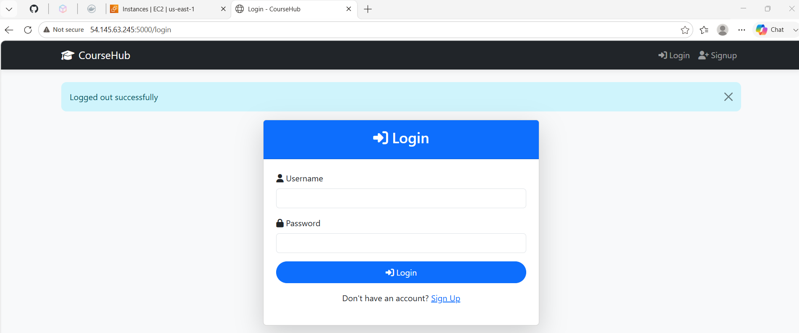

---

**Dashboard / Homepage**
> 📎 `homepage-coursehub.png` already uploaded ✅

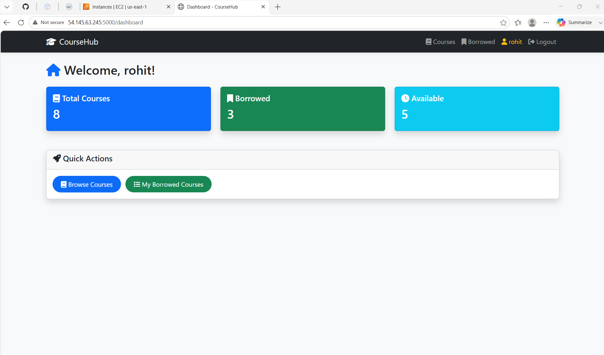

---

**Available Courses Page**
> 📎 `courses-coursehub.png` already uploaded ✅

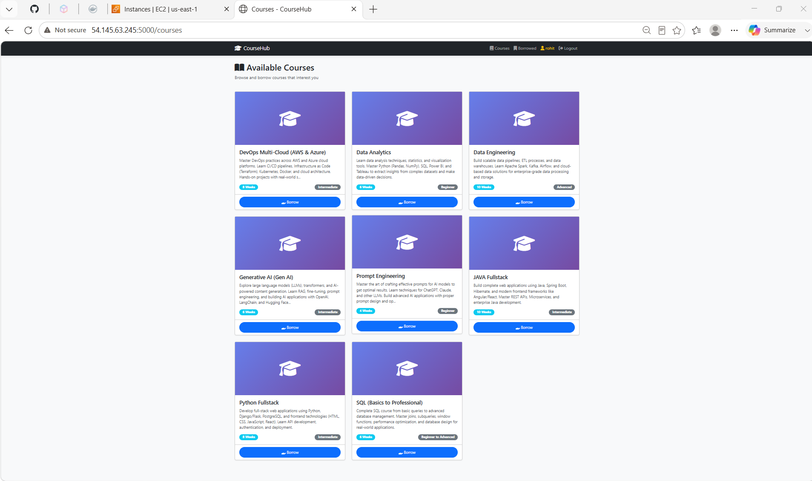

---

**My Borrowed Courses**
> 📎 `borrowedcourses-coursehub.png` already uploaded ✅

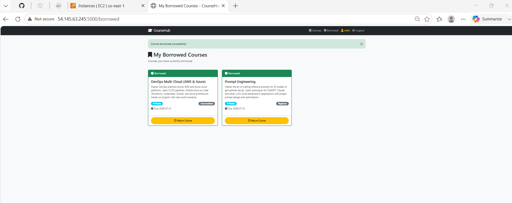

---

**PostgreSQL — Users & Borrowed Courses Tables**
> 📎 `DB-1.png` already uploaded ✅

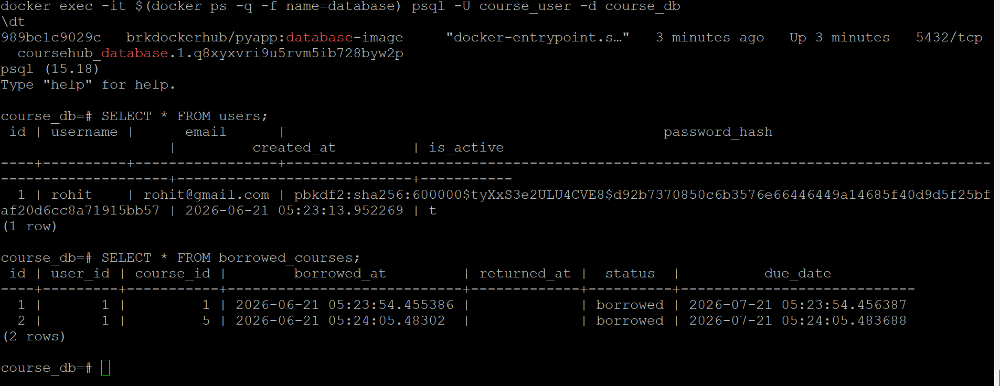

---

**PostgreSQL — Courses Table**
> 📎 `db-2.png` already uploaded ✅

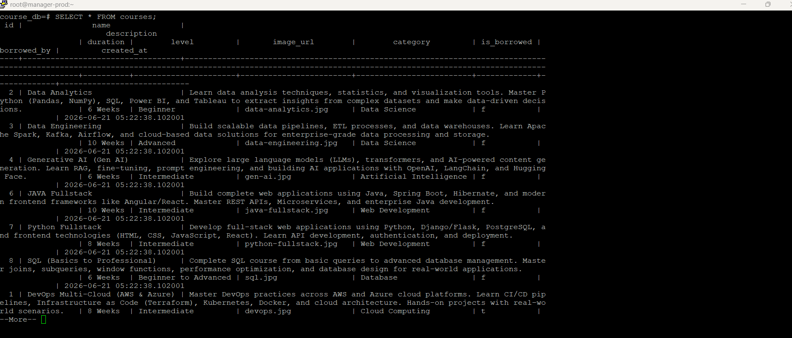

#### v1 Dashboard Stats
- Total Courses: **8**
- Borrowed: **3**
- Available: **5**

---

### v2 — LearnWithUs (`52.23.201.97:5000`)

Rebranded and improved version with updated UI and shared borrowing state visible to all users.

#### Key Changes from v1 → v2
- Application title changed: `CourseHub` → `LearnWithUs`
- Courses already borrowed by a user now show **"Borrowed by someone"** badge to other users (real-time availability)
- Dashboard resets borrowed count per user session (fresh DB state)
- Improved card layout and spacing

#### 📸 Screenshots

**Login Page**
> 📎 `loginpage-learnwithus.png` already uploaded ✅

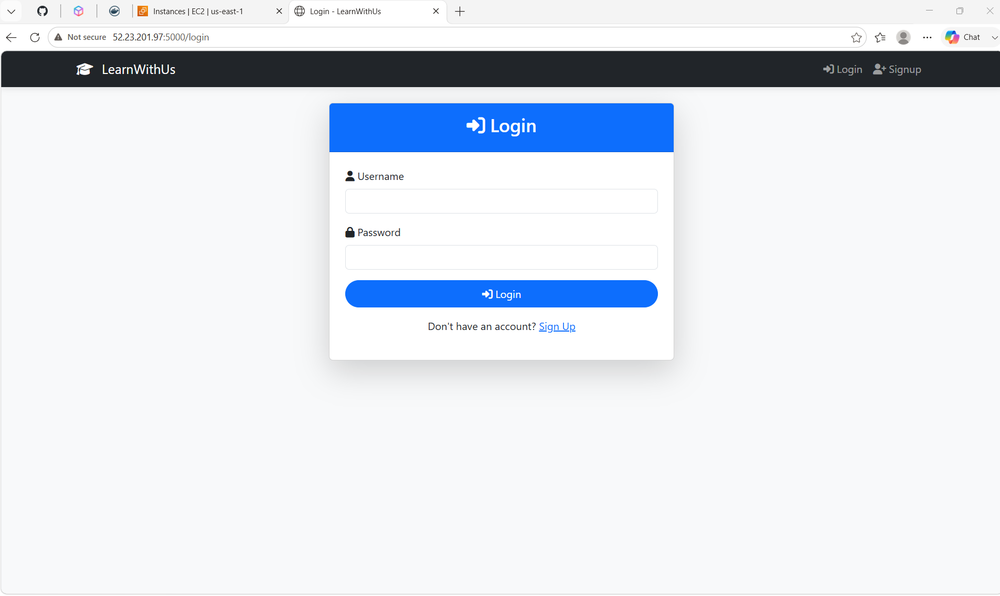

---

**Dashboard / Homepage**
> 📎 `homepage-learnwithus.png` already uploaded ✅

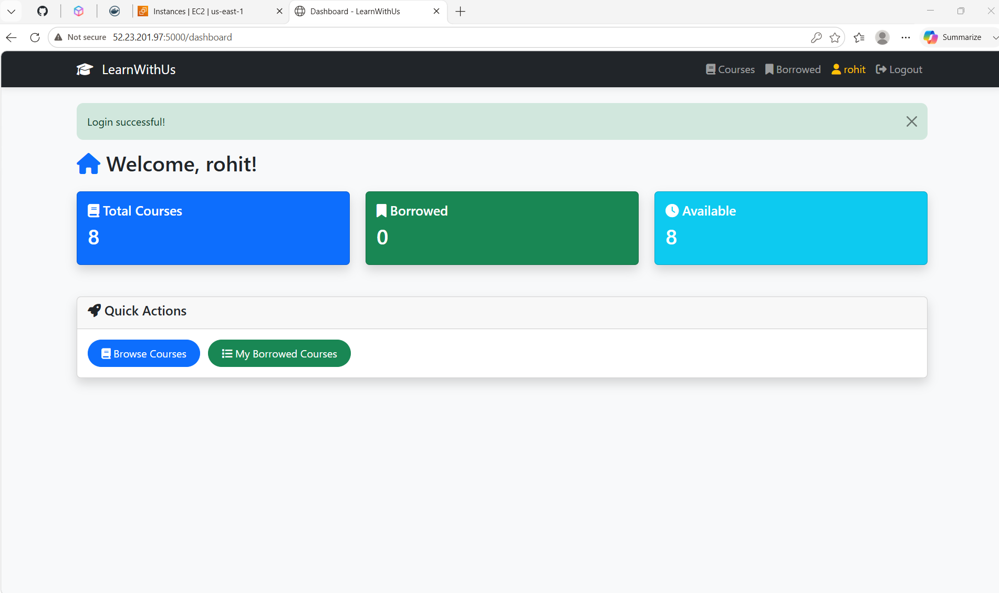

---

**My Borrowed Courses**
> 📎 `borrowedcourses-learnwithus.png` already uploaded ✅

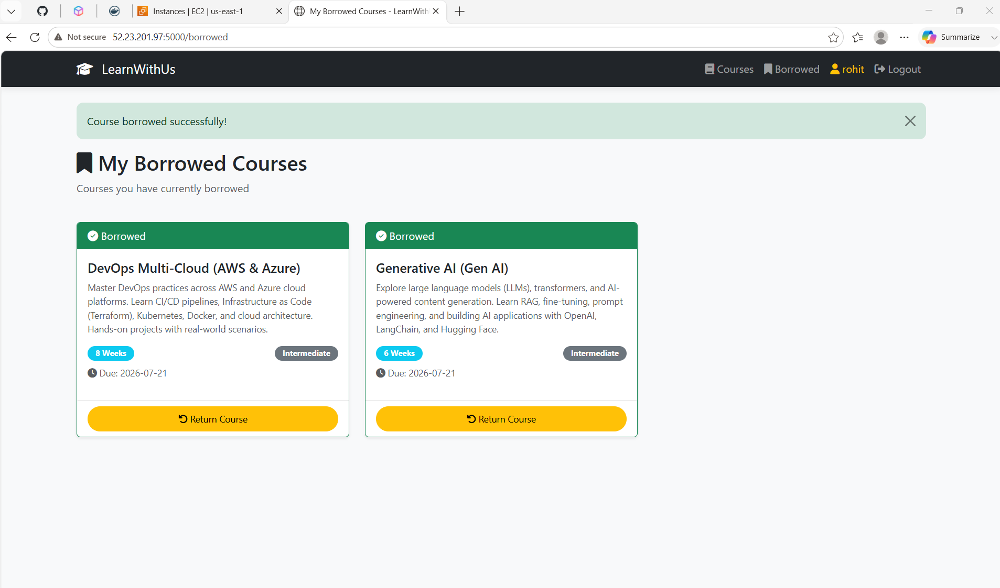

---

**Available Courses (with "Borrowed by someone" badges)**
> 📎 `availblecourses-learnwithus.png` already uploaded ✅

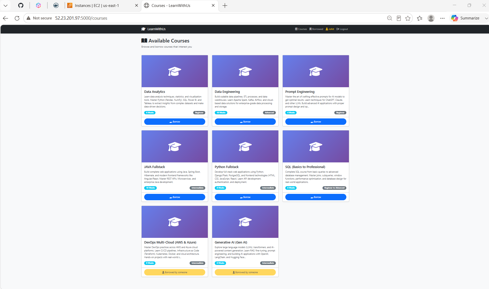

#### v2 Dashboard Stats
- Total Courses: **8**
- Borrowed: **0** (fresh state)
- Available: **8**

---

## 🔍 SonarQube Code Quality Report

> 📎 `sonarqube.png` already uploaded ✅

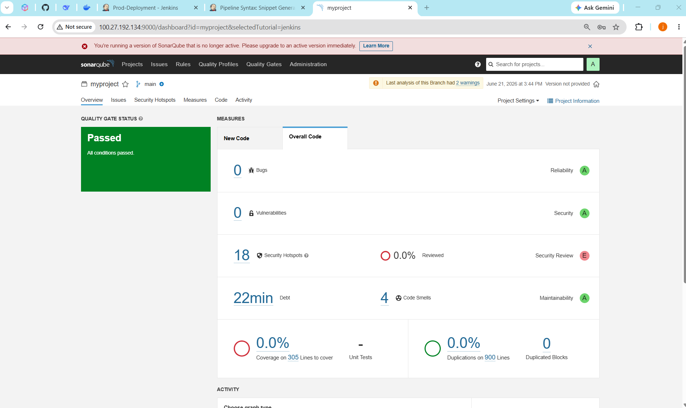

- **Quality Gate: PASSED ✅**
- Project: `myproject` | Branch: `main`
- Reliability: **A** | Security: **A** | Maintainability: **A**
- Security Review: **E** (18 hotspots unreviewed — flagged for future sprint)
- 0 Bugs | 0 Vulnerabilities | 4 Code Smells | 22 min Debt

---

## 🐳 Docker Hub Registry

> 📎 `dockerhub.png` already uploaded ✅

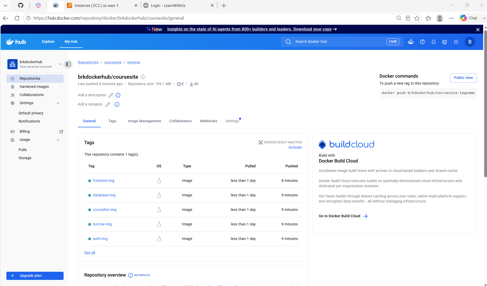

**Repository:** [`brkdockerhub/coursesite`](https://hub.docker.com/repository/docker/brkdockerhub/coursesite/general)

| Tag | Type | Last Pushed |
|---|---|---|
| `frontend-img` | Image (Linux) | < 1 day |
| `database-img` | Image (Linux) | < 1 day |
| `courselist-img` | Image (Linux) | < 1 day |
| `borrow-img` | Image (Linux) | < 1 day |
| `auth-img` | Image (Linux) | < 1 day |

**Total pushes:** 40 | **Repo size:** 193.1 MB

---

## 🧾 Jenkins Pipeline Script

> 📎 `pipelinescript-1.png` already uploaded ✅

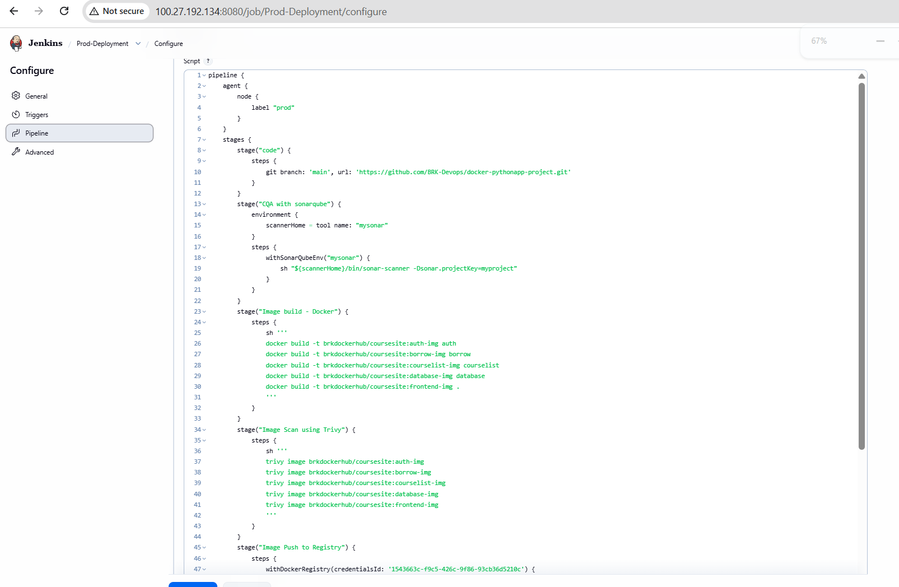

> 📎 `pipelinescript-2.png` already uploaded ✅

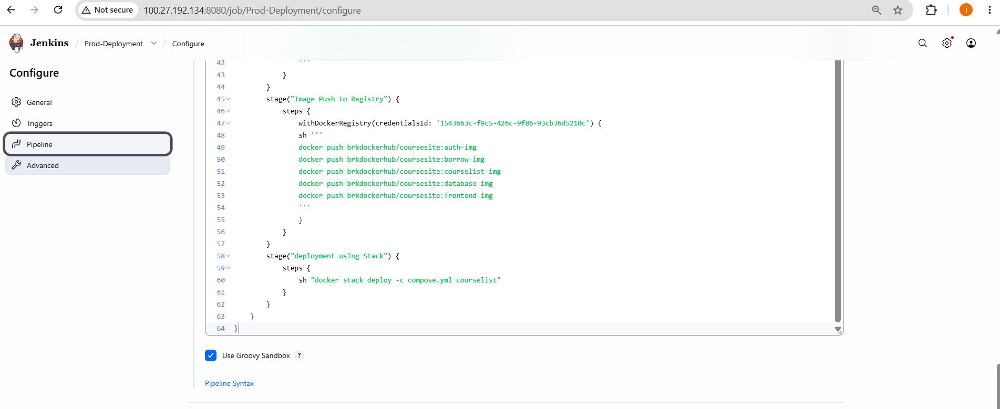

```groovy
pipeline {
    agent {
        node {
            label "prod"
        }
    }
    stages {
        stage("code") {
            steps {
                git branch: 'main', url: 'https://github.com/BRK-Devops/docker-pythonapp-project.git'
            }
        }
        stage("CQA with sonarqube") {
            environment {
                scannerHome = tool name: "mysonar"
            }
            steps {
                withSonarQubeEnv("mysonar") {
                    sh "${scannerHome}/bin/sonar-scanner -Dsonar.projectKey=myproject"
                }
            }
        }
        stage("Image build - Docker") {
            steps {
                sh '''
                docker build -t brkdockerhub/coursesite:auth-img auth
                docker build -t brkdockerhub/coursesite:borrow-img borrow
                docker build -t brkdockerhub/coursesite:courselist-img courselist
                docker build -t brkdockerhub/coursesite:database-img database
                docker build -t brkdockerhub/coursesite:frontend-img .
                '''
            }
        }
        stage("Image Scan using Trivy") {
            steps {
                sh '''
                trivy image brkdockerhub/coursesite:auth-img
                trivy image brkdockerhub/coursesite:borrow-img
                trivy image brkdockerhub/coursesite:courselist-img
                trivy image brkdockerhub/coursesite:database-img
                trivy image brkdockerhub/coursesite:frontend-img
                '''
            }
        }
        stage("Image Push to Registry") {
            steps {
                withDockerRegistry(credentialsId: '1543663c-f9c5-426c-9f86-93cb36d5210c') {
                    sh '''
                    docker push brkdockerhub/coursesite:auth-img
                    docker push brkdockerhub/coursesite:borrow-img
                    docker push brkdockerhub/coursesite:courselist-img
                    docker push brkdockerhub/coursesite:database-img
                    docker push brkdockerhub/coursesite:frontend-img
                    '''
                }
            }
        }
        stage("deployment using Stack") {
            steps {
                sh "docker stack deploy -c compose.yml courselist"
            }
        }
    }
}
```

---

## 🗄️ Database Schema (PostgreSQL)

```sql
-- Users table
SELECT * FROM users;
-- id | username | email | password_hash | created_at | is_active

-- Courses table
SELECT * FROM courses;
-- id | name | description | duration | level | image_url | category | is_borrowed | borrowed_by | created_at

-- Borrowed courses table
SELECT * FROM borrowed_courses;
-- id | user_id | course_id | borrowed_at | returned_at | status | due_date
```

**Sample data verified via `docker exec` into the database container:**
- User `rohit` — password hashed with PBKDF2:SHA256 (600,000 rounds)
- 8 seeded courses across categories: Cloud Computing, Data Science, AI, Web Development, Database
- Borrow records with `due_date` auto-set to 30 days from borrow time

### 📸 Live Database Screenshots

**Users & Borrowed Courses Tables**

> 📎 Already uploaded — [`DB-1.png`](https://github.com/BRK-Devops/docker-pythonapp-project/upload/main) · To re-upload or replace: go to your repo → **Add file → Upload files** → drop `DB-1.png` → commit


**Courses Table (Full)**

> 📎 Already uploaded — [`db-2.png`](https://github.com/BRK-Devops/docker-pythonapp-project/upload/main) · To re-upload or replace: go to your repo → **Add file → Upload files** → drop `db-2.png` → commit


---

## 📂 Project Structure

```
docker-pythonapp-project/
├── auth/               # Authentication microservice
├── borrow/             # Borrow/return microservice
├── courselist/         # Course listing microservice
├── database/           # PostgreSQL container config & seed data
├── compose.yml         # Docker Stack compose file
├── Dockerfile          # Frontend image build
└── sonar-project.properties
```

---

## ▶️ How to Run Locally

```bash
# Clone the repository
git clone https://github.com/BRK-Devops/docker-pythonapp-project.git
cd docker-pythonapp-project

# Initialize Docker Swarm (if not already)
docker swarm init

# Deploy the stack
docker stack deploy -c compose.yml courselist

# Access the app
open http://localhost:5000
```

---

## 🧠 Experience & Skills Gained

### DevOps & CI/CD
- Built a **multi-stage Jenkins declarative pipeline** from scratch covering code checkout, QA, build, scan, push, and deploy
- Configured **SonarQube** with a custom project key and integrated it as a Jenkins environment tool (`withSonarQubeEnv`)
- Used **Trivy** to perform container image vulnerability scanning on all 5 microservice images before pushing to registry
- Managed **Docker Hub credentials** securely in Jenkins using `withDockerRegistry` and credential IDs

### Docker & Orchestration
- Designed a **microservices architecture** split across 5 Docker images (auth, borrow, courselist, database, frontend)
- Used **Docker Stack** (`docker stack deploy`) for production-grade Swarm deployment with a `compose.yml`
- Understood Docker **service naming, image tagging conventions**, and inter-service networking in Swarm mode

### Application Development
- Built a Python web app with **user authentication**, **session management**, **course borrowing/returning** logic
- Designed and queried a **PostgreSQL relational schema** with `users`, `courses`, and `borrowed_courses` tables
- Validated DB state directly via `docker exec ... psql` — confirming live data integrity end to end
- Implemented **real-time availability tracking** — courses borrowed by one user show as unavailable to others (v2 feature)

### Infrastructure & AWS
- Deployed on **AWS EC2 (us-east-1)** — managed two separate EC2 instances for v1 and v2 environments
- Understood **security group configuration** for exposing ports (5000 for app, 9000 for SonarQube, 8080 for Jenkins)

### Iterative Development
- Evolved the project across **two versions** (v1 → v2) with a rebrand, UI improvements, and a new shared-borrowing feature — demonstrating real-world iterative delivery

---


## 👤 Author

**Behara Rohit Kumar** | Software Engineer - DevOps  
Built with 🐍 Python · 🐳 Docker · ⚙️ Jenkins · 🔍 SonarQube · 🛡️ Trivy · ☁️ AWS EC2
